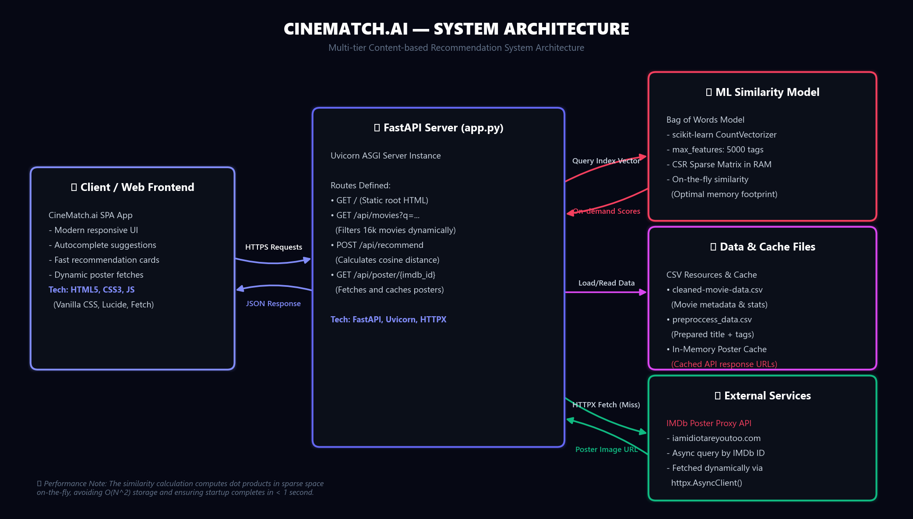
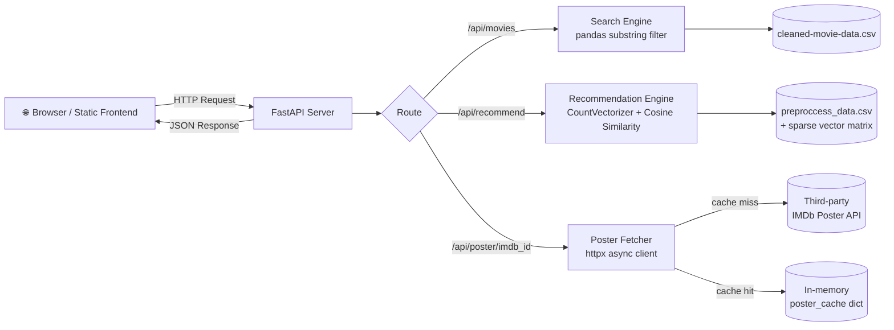
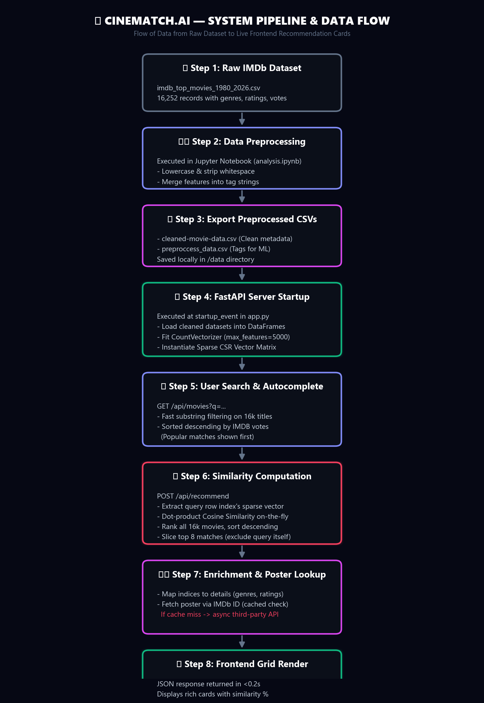
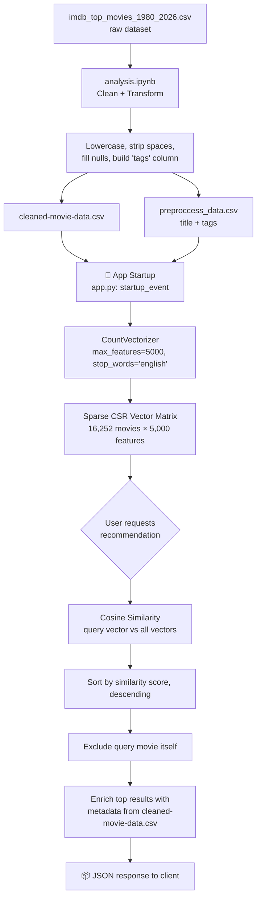
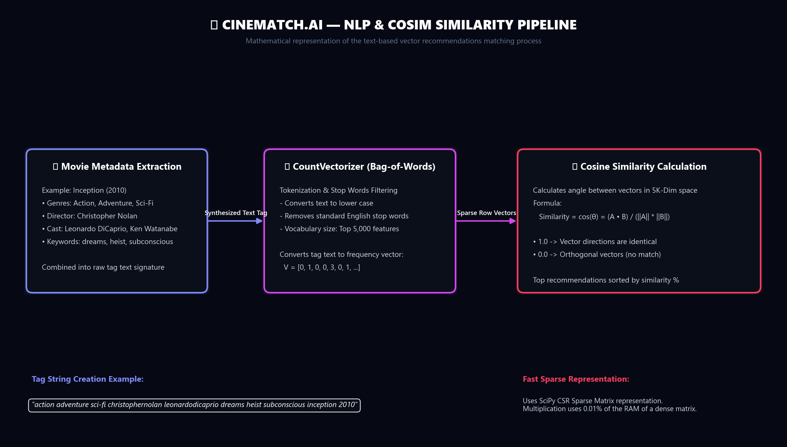
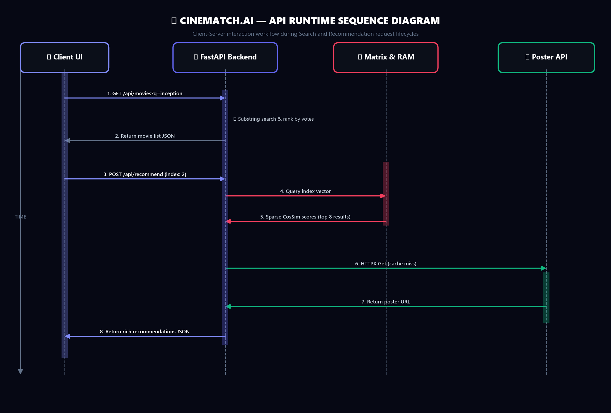
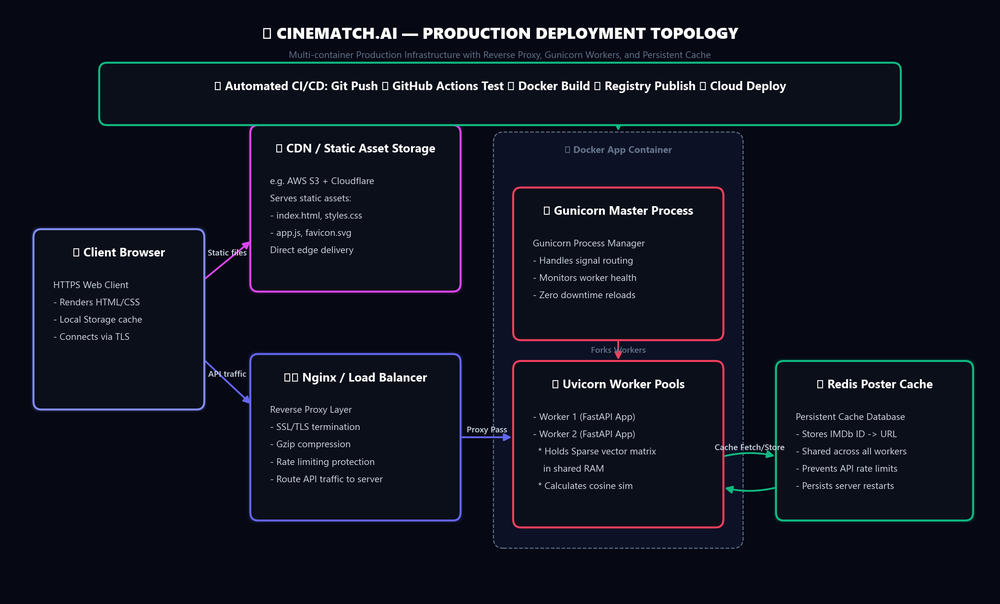
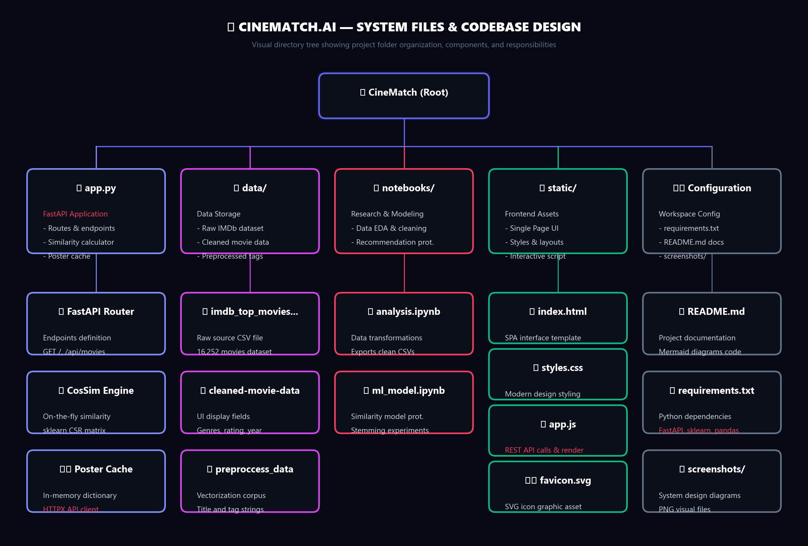

<div align="center">

# 🎬 CineMatch — Content-Based Movie Recommendation System

**A FastAPI-powered movie recommender that suggests similar titles using NLP-based content similarity over 16,000+ IMDB movies.**


[](https://cin-match-ai.vercel.app/)


</div>

---

## 📑 Table of Contents

- [About the Project](#-about-the-project)
- [Features](#-features)
- [Live Demo](#-live-demo)
- [Architecture Overview](#-architecture-overview)
- [How Recommendations Work](#-how-recommendations-work)
- [Project Structure](#-project-structure)
- [Tech Stack](#-tech-stack)
- [Getting Started](#-getting-started)
- [API Reference](#-api-reference)
- [Dataset Insights](#-dataset-insights)
- [Notebooks](#-notebooks)
- [Known Considerations](#-known-considerations--mentor-notes)
- [Roadmap](#-roadmap)
- [Contributing](#-contributing)
- [License](#-license)
- [Acknowledgments](#-acknowledgments)

---

## 🧠 About the Project

**CineMatch** is a content-based movie recommendation engine. Instead of relying on user ratings or collaborative behavior, it recommends movies that are *textually similar* to a movie you already like — comparing titles, genres, release year, and IMDb ID as a combined "tag" signature using a **Bag-of-Words (CountVectorizer)** model and **cosine similarity**.

The backend is served via **FastAPI**, with similarity scores computed on-the-fly against a precomputed sparse vector matrix built at server startup — keeping memory usage low while still scaling to ~16,000 movies.

---

## ✨ Features

- 🔍 **Title search with autocomplete** — fuzzy substring search, ranked by popularity (vote count)
- 🎯 **Content-based recommendations** — top similar movies for any selected title
- 🏷️ **Rich metadata** — year, genres, IMDb rating, vote count returned with every result
- 🖼️ **Poster fetching** — on-demand poster lookup via IMDb ID, with in-memory caching
- 🌐 **CORS-enabled REST API** — ready to be consumed by any frontend
- 🖥️ **Lightweight static frontend** — served directly from FastAPI (`/static`)

---

## 🖥️ Live Demo

| | |
|---|---|
| **Status** | Deployed On Vercel And Render |
| **Local URL** | `http://127.0.0.1:8000` (after running locally — see [Getting Started](#-getting-started)) |

> 💡 Once you deploy this (e.g. on Render, Railway, Fly.io, or a VPS), drop the live link here:
>
 [](https://cin-match-ai.vercel.app/)

---

## 🏗️ Architecture Overview



<details>
<summary>💻 View Mermaid Diagram Source</summary>



</details>

---

## 🔄 How Recommendations Work & NLP Pipeline



<details>
<summary>💻 View Mermaid Diagram Source</summary>



</details>

---

## 📐 Cosine Similarity Matching Pipeline

Detailed mathematical matching representation of the NLP model:



**Why on-the-fly instead of a precomputed full similarity matrix?**
Computing a full `16,252 × 16,252` similarity matrix upfront would use significant memory. Instead, `app.py` keeps only the sparse vectorized representation in memory and computes cosine similarity for **just the requested row** at request time — a good memory/latency trade-off at this dataset size.

---

## ⏱️ Runtime API Sequence Flow

Visual representation of search autocomplete and recommendation requests lifecycle:



---

## 🐳 Production Deployment Infrastructure

Sleek architectural topology layout for deploying, scaling, and caching in production:



---

## 📁 System Design & Codebase Folder Structure

Visual tree representation showing how codebase directories and components map to their functional roles:



---

## 🗂️ Project Structure

```text
.
├── app.py                          # FastAPI backend (routes, ML inference, startup logic)
├── README.md                       # Project documentation
├── requirements.txt                # Python dependencies
├── notebooks/
│   ├── analysis.ipynb              # EDA + data cleaning → produces cleaned CSVs
│   └── ml_model.ipynb              # Recommendation model prototyping
├── data/
│   ├── imdb_top_movies_1980_2026.csv   # Raw source dataset
│   ├── cleaned-movie-data.csv          # Cleaned metadata (used for display)
│   └── preproccess_data.csv            # title + tags (used for vectorization)
└── static/
    ├── index.html                  # Frontend entry point
    ├── styles.css
    ├── app.js
    └── favicon.svg
```

---

## ⚙️ Tech Stack

| Layer | Technology | Purpose |
|---|---|---|
| **API Framework** | FastAPI | Async REST API, auto-generated OpenAPI docs |
| **Server** | Uvicorn | ASGI server, hot-reload in dev |
| **Data Handling** | Pandas, NumPy | CSV loading, filtering, transformation |
| **ML / NLP** | scikit-learn (`CountVectorizer`, `cosine_similarity`) | Text vectorization & similarity scoring |
| **HTTP Client** | HTTPX | Async poster lookups from external API |
| **Validation** | Pydantic | Request body schema validation |
| **Frontend** | HTML / CSS / JavaScript | Static UI served from `/static` |
| **Notebooks** | Jupyter (`nltk` for stemming experiments) | Exploratory data analysis & modeling |

---

## 🚀 Getting Started

### Prerequisites
- Python 3.9+
- `pip` and a virtual environment tool

### 1. Clone the repository
```bash
git clone <your-repo-url>
cd <repo-folder>
```

### 2. Create and activate a virtual environment
```bash
python -m venv venv
source venv/bin/activate        # Windows: venv\Scripts\activate
```

### 3. Install dependencies
```bash
pip install -r requirements.txt
```

### 4. Run the application
```bash
python app.py
```

The app will be available at:
```text
http://127.0.0.1:8000
```

Interactive API docs (auto-generated by FastAPI) will be available at:
```text
http://127.0.0.1:8000/docs
```

---

## 🔌 API Reference

| Method | Endpoint | Description |
|---|---|---|
| `GET` | `/` | Serves the frontend (`index.html`) |
| `GET` | `/api/movies?q={query}` | Search movies by title (autocomplete, sorted by popularity) |
| `POST` | `/api/recommend` | Returns similar movies for a given movie `index` or `title` |
| `GET` | `/api/poster/{imdb_id}` | Returns a poster URL for the given IMDb ID (cached) |

### Example — Search
```http
GET /api/movies?q=inception
```

### Example — Recommend
```http
POST /api/recommend
Content-Type: application/json

{
  "index": 2
}
```

**Response shape:**
```json
{
  "query_movie": {
    "index": 2,
    "title": "Inception",
    "imdb_id": "1375666",
    "year": 2010,
    "genres": ["Action", "Adventure", "Sci-Fi"],
    "rating": 8.8,
    "votes": 2811692
  },
  "recommendations": [
    {
      "index": 0,
      "title": "...",
      "imdb_id": "...",
      "year": 0,
      "genres": ["..."],
      "rating": 0.0,
      "votes": 0,
      "similarity": 0.0
    }
  ]
}
```

### Example — Poster
```http
GET /api/poster/tt1375666
```

---

## 📊 Dataset Insights

Derived from exploratory analysis in `analysis.ipynb`:

| Metric | Value |
|---|---|
| Total movies | 16,252 |
| Coverage | 1980 – 2026 |
| Movies released in 2026 | 62 |
| Distinct genre combinations | 506 |
| Most common genre combo | `Comedy, Drama, Romance` (760 movies) |
| Missing `genres` values (pre-cleaning) | 6 (filled with `"Unknown"`) |
| Missing `runtime_minutes` (pre-cleaning) | 1 (filled with column mean) |

---

## 🧪 Notebooks

- **`analysis.ipynb`** — Loads the raw IMDB dataset, handles nulls, normalizes text (lowercasing, space removal), builds the `tags` field used for vectorization, and exports `cleaned-movie-data.csv` and `preproccess_data.csv`.
- **`ml_model.ipynb`** — Prototypes the recommendation logic: fits a `CountVectorizer`, builds a dense similarity matrix, and experiments with `nltk`'s `PorterStemmer` for tag normalization. This notebook is exploratory — the production logic in `app.py` re-implements the core idea using a **sparse** matrix and **on-demand** similarity computation for better memory efficiency.

---

## 🔎 Known Considerations & Mentor Notes

A few things worth keeping an eye on as the project grows — flagging these now so they don't surprise you later:

1. **Docstring vs. actual behavior**: the `/api/recommend` docstring says it returns the "top 6" recommendations, but the loop logic (`if len(recommendations) >= 8: break`) actually returns up to **8**. Worth aligning the comment with the code (or vice versa) so future contributors aren't misled.
2. **Stemming isn't wired into the live app**: `ml_model.ipynb` applies `PorterStemmer` to tags, but `app.py` does not — and in the notebook itself, stemming is applied *after* `CountVectorizer` has already been fit, so it has no effect there either. If stemming is meant to improve similarity quality, it needs to happen before fitting and be carried into `app.py`.
3. **Third-party poster API dependency**: poster lookups rely on an unofficial, community-run IMDb proxy (`imdb.iamidiotareyoutoo.com`). It's not an official IMDb/OMDb service, so treat it as best-effort — consider a fallback (e.g., OMDb API with an API key) for production reliability.
4. **No persistent cache**: `poster_cache` is an in-memory Python dict, so it resets on every server restart. Fine for development; consider Redis or a local SQLite cache if this goes to production.
5. **No `requirements.txt` pinning visible in this review** — make sure versions are pinned (`fastapi==`, `pandas==`, etc.) before deploying, to avoid breaking changes from upstream releases.
6. **No `LICENSE` file currently present** — see [License](#-license) below.

---


---

## 🙏 Acknowledgments

- Movie metadata sourced from IMDb-derived datasets
- Poster lookups via a community-run IMDb proxy API
- Built with FastAPI, scikit-learn, and Pandas

---

<div align="center">

Made with 🎥 and a love for good recommendations.

</div>
